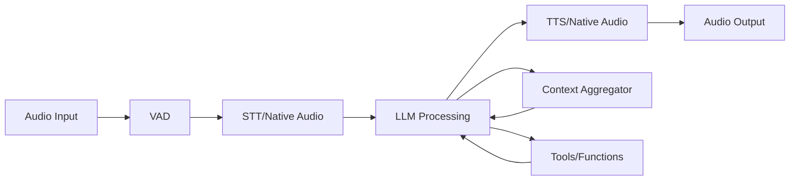

# PipeCat Voice Agent Development Guide

A comprehensive tutorial for building production-ready voice agents with PipeCat framework from scratch.

## Table of Contents

1. [Framework Foundation](#1-framework-foundation)
2. [Voice Agent Core Implementation](#2-voice-agent-core-implementation)
3. [Advanced Tool Integration System](#3-advanced-tool-integration-system)
4. [WebSocket Communication Architecture](#4-websocket-communication-architecture)
5. [Production-Ready Examples](#5-production-ready-examples)
6. [Troubleshooting & Best Practices](#6-troubleshooting--best-practices)

---

## 1. Framework Foundation

### 1.1 PipeCat Architecture Overview

PipeCat is a framework for building real-time voice AI applications with native audio streaming capabilities. The architecture follows a pipeline-based approach where audio flows through a series of processors.



### 1.2 Core Concepts

#### Pipeline Components
- **Transport**: Handles WebSocket communication and audio streaming
- **Processors**: Transform and process frames (audio, text, control)
- **Services**: External AI services (STT, TTS, LLM)
- **Aggregators**: Manage conversation context and memory

#### Frame Types
- **Audio Frames**: Raw audio data
- **Text Frames**: Transcribed speech and responses
- **Control Frames**: System commands and metadata
- **Function Call Frames**: Tool execution requests

### 1.3 Dependencies and Installation

#### Core Dependencies (from analyzed projects)

```txt
# Core PipeCat framework
pipecat-ai==0.0.73

# FastAPI and WebSocket support
fastapi==0.104.1
uvicorn[standard]==0.24.0
websockets==13.1
python-multipart==0.0.6

# Environment and logging
python-dotenv>=1.0.0
loguru>=0.7.0

# Audio processing and VAD
torch>=2.0.0
torchaudio>=2.0.0
numpy>=1.24.0
scipy>=1.10.0
soundfile>=0.12.0
librosa>=0.10.0
resampy>=0.4.0
onnxruntime>=1.16.0

# Native Audio LLM Services
openai>=1.0.0
google-generativeai>=0.3.0
grpcio>=1.50.0

# Fallback Services
deepgram-sdk>=3.0.0
cartesia>=1.0.0
elevenlabs>=1.0.0
```

#### Installation Steps

```bash
# 1. Create virtual environment
python -m venv venv
source venv/bin/activate  # On Windows: venv\Scripts\activate

# 2. Install dependencies
pip install -r requirements.txt

# 3. Set up environment variables
cp .env.example .env
# Edit .env with your API keys
```

### 1.4 Project Structure

```
voice_agent/
├── main.py                 # Main application entry point
├── requirements.txt        # Dependencies
├── .env                   # Environment variables
├── .env.example          # Environment template
├── config/
│   ├── __init__.py
│   ├── settings.py       # Configuration management
│   └── instructions.py   # System prompts
├── tools/
│   ├── __init__.py
│   ├── base_tool.py      # Base tool class
│   ├── example_tool.py   # Example tool implementation
│   └── tool_registry.py  # Tool management
├── utils/
│   ├── __init__.py
│   ├── websocket_registry.py  # WebSocket management
│   └── validation.py     # Input validation
└── docs/
    └── README.md         # Documentation
```

### 1.5 Environment Configuration

#### Essential Environment Variables

```bash
# Native Audio LLM Services (choose one for optimal performance)
OPENAI_API_KEY=sk-your_openai_api_key_here
GOOGLE_API_KEY=your_google_api_key_here

# Fallback Services (optional but recommended)
DEEPGRAM_API_KEY=your_deepgram_api_key_here
CARTESIA_API_KEY=your_cartesia_api_key_here
ELEVENLABS_API_KEY=your_elevenlabs_api_key_here

# Server Configuration
SERVER_HOST=0.0.0.0
SERVER_PORT=8002
LOG_LEVEL=INFO
```

#### Configuration Validation

```python
import os
from typing import Optional
from dotenv import load_dotenv
from loguru import logger

load_dotenv(override=True)

def is_valid_api_key(key: Optional[str], key_type: str) -> bool:
    """Validate API key format and content."""
    if not key:
        return False
    
    # Check for placeholder patterns
    placeholders = ["your_", "sk-your_", "example", "placeholder"]
    key_lower = key.lower()
    for placeholder in placeholders:
        if placeholder in key_lower:
            return False
    
    # Basic format validation
    if key_type == "openai" and not key.startswith("sk-"):
        return False
    if key_type == "google" and not key.startswith("AI"):
        return False
    
    return True

# Validate configuration
OPENAI_API_KEY = os.getenv("OPENAI_API_KEY")
GOOGLE_API_KEY = os.getenv("GOOGLE_API_KEY")

if not (is_valid_api_key(OPENAI_API_KEY, "openai") or 
        is_valid_api_key(GOOGLE_API_KEY, "google")):
    raise ValueError("No valid LLM API key configured")
```

---

## 2. Voice Agent Core Implementation

### 2.1 Pipeline Architecture

The voice agent pipeline follows this flow:
**Audio Input → VAD → STT/Native → LLM → TTS/Native → Audio Output**

#### Transport Configuration

```python
from pipecat.transports.network.fastapi_websocket import (
    FastAPIWebsocketTransport,
    FastAPIWebsocketParams,
)
from pipecat.audio.vad.silero import SileroVADAnalyzer
from pipecat.audio.vad.vad_analyzer import VADParams
from pipecat.serializers.protobuf import ProtobufFrameSerializer

# Create WebSocket transport with VAD
transport = FastAPIWebsocketTransport(
    websocket=websocket,
    params=FastAPIWebsocketParams(
        audio_in_enabled=True,
        audio_out_enabled=True,
        add_wav_header=False,
        vad_analyzer=SileroVADAnalyzer(
            params=VADParams(stop_secs=0.5)
        ),
        serializer=ProtobufFrameSerializer(),
    ),
)
```

#### LLM Service Selection

```python
async def create_llm_service(enable_function_calling=True):
    """Create LLM service with fallback logic."""
    
    # Try OpenAI Realtime API first (ultra-low latency)
    if OPENAI_REALTIME_AVAILABLE and is_valid_api_key(OPENAI_API_KEY, "openai"):
        from pipecat.services.openai_realtime_beta import (
            OpenAIRealtimeBetaLLMService,
            SessionProperties,
            InputAudioTranscription,
            SemanticTurnDetection,
        )
        
        session_properties = SessionProperties(
            input_audio_transcription=InputAudioTranscription(),
            turn_detection=SemanticTurnDetection(),
            instructions=SYSTEM_INSTRUCTION
        )
        
        return OpenAIRealtimeBetaLLMService(
            api_key=OPENAI_API_KEY,
            session_properties=session_properties,
        ), "openai_realtime"
    
    # Try Gemini Live (multilingual support)
    if GEMINI_LIVE_AVAILABLE and is_valid_api_key(GOOGLE_API_KEY, "google"):
        from pipecat.services.gemini_multimodal_live.gemini import GeminiMultimodalLiveLLMService
        
        tools_schema = None
        if enable_function_calling:
            tools_schema = create_tools_schema()
        
        return GeminiMultimodalLiveLLMService(
            api_key=GOOGLE_API_KEY,
            system_instruction=SYSTEM_INSTRUCTION,
            voice_id="Puck",  # Available: Zephyr, Aoede, Charon, Fenrir, Kore, Puck
            model="models/gemini-live-2.5-flash-preview",
            transcribe_model_audio=True,
            tools=tools_schema,
        ), "gemini_live"
    
    # Fallback to traditional STT→LLM→TTS pipeline
    return create_fallback_pipeline()
```

### 2.2 Context Management

Context aggregators maintain conversation memory and enable function calling:

```python
from pipecat.processors.aggregators.openai_llm_context import OpenAILLMContext

# Create conversation context
context = OpenAILLMContext([{
    "role": "user",
    "content": "Start by greeting the user warmly and asking how you can help them today."
}])

# Create context aggregator
context_aggregator = llm_service.create_context_aggregator(context)
```

### 2.3 Pipeline Construction

```python
from pipecat.pipeline.pipeline import Pipeline
from pipecat.pipeline.task import PipelineTask, PipelineParams
from pipecat.processors.frameworks.rtvi import RTVIProcessor, RTVIConfig, RTVIObserver

# Create RTVI processor for client communication
rtvi = RTVIProcessor(config=RTVIConfig(config=[]))

# Build pipeline based on LLM type
if llm_type == "openai_realtime":
    pipeline = Pipeline([
        transport.input(),
        context_aggregator.user(),
        rtvi,
        llm_service,
        transcript.user(),
        transport.output(),
        transcript.assistant(),
        context_aggregator.assistant(),
    ])
else:  # gemini_live or fallback
    pipeline = Pipeline([
        transport.input(),
        context_aggregator.user(),
        rtvi,
        llm_service,
        transport.output(),
        context_aggregator.assistant(),
    ])

# Create pipeline task
task = PipelineTask(
    pipeline,
    params=PipelineParams(
        enable_metrics=True,
        enable_usage_metrics=True,
    ),
    observers=[RTVIObserver(rtvi)],
)
```

---

## 3. Advanced Tool Integration System

### 3.1 Tool Base Class

Create a standardized base class for all tools:

```python
# tools/base_tool.py
from abc import ABC, abstractmethod
from typing import Dict, Any, Optional
from pipecat.adapters.schemas.function_schema import FunctionSchema
from loguru import logger

class BaseTool(ABC):
    """Base class for all voice agent tools."""

    def __init__(self, rtvi_processor, task=None):
        self.rtvi_processor = rtvi_processor
        self.task = task
        self.tool_name = self.__class__.__name__.lower().replace('tool', '')
        logger.info(f"🔧 Initialized tool: {self.tool_name}")

    @abstractmethod
    def get_tool_definition(self) -> FunctionSchema:
        """Define the tool schema for LLM function calling."""
        pass

    @abstractmethod
    async def execute(self, action: str, **kwargs) -> str:
        """Execute the tool action."""
        pass

    def validate_action(self, action: str, valid_actions: list) -> bool:
        """Validate that the requested action is allowed."""
        if action not in valid_actions:
            logger.warning(f"Invalid action '{action}' for {self.tool_name}")
            return False
        return True

    async def send_client_command(self, command_type: str, data: Dict[Any, Any]):
        """Send command to client via WebSocket."""
        try:
            from utils.websocket_registry import send_to_user_websocket

            command = {
                "type": command_type,
                "tool": self.tool_name,
                "data": data,
                "timestamp": self._get_timestamp()
            }

            await send_to_user_websocket(self.user_id, command)
            logger.debug(f"Command '{command_type}' sent to client")

        except Exception as e:
            logger.error(f"Error sending client command: {e}")

    def _get_timestamp(self) -> str:
        """Get current timestamp."""
        from datetime import datetime
        return datetime.now().isoformat()
```

### 3.2 Creating Custom Tools

Example tool implementation:

```python
# tools/example_tool.py
from .base_tool import BaseTool
from pipecat.adapters.schemas.function_schema import FunctionSchema

class ExampleTool(BaseTool):
    """Example tool demonstrating best practices."""

    def __init__(self, rtvi_processor, task=None):
        super().__init__(rtvi_processor, task)
        self.current_data = {}

    def get_tool_definition(self) -> FunctionSchema:
        """Define the tool schema for the LLM."""
        return FunctionSchema(
            name="manage_example",
            description="Create, update, or manage example data.",
            properties={
                "action": {
                    "type": "string",
                    "enum": ["create", "update", "delete", "get"],
                    "description": "The action to perform"
                },
                "field": {
                    "type": "string",
                    "enum": ["name", "email", "phone", "address"],
                    "description": "The field to update (required for update action)"
                },
                "value": {
                    "type": "string",
                    "description": "The value to set (required for update action)"
                }
            },
            required=["action"]
        )

    async def execute(self, action: str, **kwargs) -> str:
        """Execute the tool action."""
        valid_actions = ["create", "update", "delete", "get"]

        if not self.validate_action(action, valid_actions):
            return f"Invalid action. Valid actions: {valid_actions}"

        try:
            if action == "create":
                return await self._create_data(**kwargs)
            elif action == "update":
                return await self._update_data(**kwargs)
            elif action == "delete":
                return await self._delete_data(**kwargs)
            elif action == "get":
                return await self._get_data(**kwargs)

        except Exception as e:
            logger.error(f"Error executing {action}: {e}")
            return f"Error executing {action}: {str(e)}"

    async def _create_data(self, **kwargs) -> str:
        """Create new data entry."""
        self.current_data = {
            "name": "",
            "email": "",
            "phone": "",
            "address": ""
        }

        # Send update to client
        await self.send_client_command("data_created", {
            "message": "New data entry created",
            "data": self.current_data
        })

        return "New data entry created successfully"

    async def _update_data(self, field: str = None, value: str = None, **kwargs) -> str:
        """Update existing data."""
        if not field or not value:
            return "Field and value are required for update action"

        valid_fields = ["name", "email", "phone", "address"]
        if field not in valid_fields:
            return f"Invalid field. Valid fields: {valid_fields}"

        self.current_data[field] = value

        # Send update to client
        await self.send_client_command("data_updated", {
            "field": field,
            "value": value,
            "data": self.current_data
        })

        return f"Updated {field} to {value}"

    async def _delete_data(self, **kwargs) -> str:
        """Delete data entry."""
        self.current_data = {}

        await self.send_client_command("data_deleted", {
            "message": "Data entry deleted"
        })

        return "Data entry deleted successfully"

    async def _get_data(self, **kwargs) -> str:
        """Get current data."""
        if not self.current_data:
            return "No data available"

        return f"Current data: {self.current_data}"

# Factory function
def create_example_tool(rtvi_processor, task=None) -> ExampleTool:
    """Create and return an ExampleTool instance."""
    return ExampleTool(rtvi_processor, task)
```

### 3.3 Tool Registry System

```python
# tools/tool_registry.py
from typing import Dict, List, Type, Optional, Any
from loguru import logger
from .base_tool import BaseTool

class ToolRegistry:
    """Registry for managing tools dynamically."""

    def __init__(self):
        self._tool_classes: Dict[str, Type[BaseTool]] = {}
        self._active_tools: Dict[str, BaseTool] = {}
        logger.info("🔧 Initialized ToolRegistry")

    def register_tool(self, tool_name: str, tool_class: Type[BaseTool]):
        """Register a tool class."""
        if not issubclass(tool_class, BaseTool):
            raise ValueError(f"Tool class must inherit from BaseTool")

        self._tool_classes[tool_name] = tool_class
        logger.info(f"🔧 Registered tool: {tool_name}")

    def create_tool(self, tool_name: str, rtvi_processor, task=None) -> Optional[BaseTool]:
        """Create an instance of a registered tool."""
        if tool_name not in self._tool_classes:
            logger.error(f"Tool '{tool_name}' not registered")
            return None

        try:
            tool_class = self._tool_classes[tool_name]
            tool_instance = tool_class(rtvi_processor, task)
            self._active_tools[tool_name] = tool_instance
            return tool_instance
        except Exception as e:
            logger.error(f"Error creating tool {tool_name}: {e}")
            return None

    def get_tool_definitions(self) -> List[Dict]:
        """Get all tool definitions for LLM."""
        definitions = []
        for tool_name, tool_instance in self._active_tools.items():
            try:
                definitions.append(tool_instance.get_tool_definition())
            except Exception as e:
                logger.error(f"Error getting definition for {tool_name}: {e}")
        return definitions

    def get_active_tools(self) -> Dict[str, BaseTool]:
        """Get all active tool instances."""
        return self._active_tools.copy()

# Global registry instance
global_tool_registry = ToolRegistry()
```

### 3.4 Function Call Handling

```python
# Function call handler in main application
async def handle_function_call(function_call):
    """Handle function calls from LLM."""
    function_name = function_call.name
    args = function_call.arguments

    logger.info(f"🔧 Handling function: {function_name} with args: {args}")

    # Find the appropriate tool instance
    tool_instance = None
    for tool_name, tool_obj in global_tool_registry.get_active_tools().items():
        tool_def = tool_obj.get_tool_definition()
        if tool_def.name == function_name:
            tool_instance = tool_obj
            break

    if tool_instance:
        # Execute the tool
        action = args.get("action")
        if action:
            # Remove action from args to avoid duplicate parameter
            filtered_args = {k: v for k, v in args.items() if k != "action"}
            result = await tool_instance.execute(action, **filtered_args)
        else:
            # For tools that don't require action parameter
            result = await tool_instance.execute(**args)

        logger.info(f"🔧 Tool execution result: {result}")
        return result
    else:
        logger.error(f"🔧 Tool {function_name} not found")
        return f"Tool {function_name} not available"

# Register function handler with LLM service
llm_service.register_function("manage_example", handle_function_call)
```

---

## 4. WebSocket Communication Architecture

### 4.1 WebSocket Registry System

```python
# utils/websocket_registry.py
from typing import Dict, Optional
from fastapi import WebSocket
from loguru import logger

# User-specific WebSocket connections
user_websockets: Dict[str, WebSocket] = {}
session_user_mapping: Dict[str, str] = {}

def register_websocket(user_id: str, websocket: WebSocket) -> None:
    """Register a WebSocket for a specific user."""
    user_websockets[user_id] = websocket
    logger.info(f"🔌 Registered WebSocket for user: {user_id}")

def unregister_websocket(user_id: str) -> None:
    """Unregister a WebSocket for a specific user."""
    if user_id in user_websockets:
        del user_websockets[user_id]
        logger.info(f"🧹 Unregistered WebSocket for user: {user_id}")

def get_websocket(user_id: str) -> Optional[WebSocket]:
    """Get the WebSocket for a specific user."""
    return user_websockets.get(user_id)

async def send_to_user_websocket(user_id: str, data: dict) -> bool:
    """Send data to a specific user's WebSocket."""
    websocket = get_websocket(user_id)
    if websocket:
        try:
            await websocket.send_json(data)
            logger.info(f"✅ Sent data to user {user_id}")
            return True
        except Exception as e:
            logger.error(f"❌ Failed to send data to user {user_id}: {e}")
            unregister_websocket(user_id)
            return False
    else:
        logger.warning(f"⚠️ No WebSocket found for user: {user_id}")
        return False

def register_session_user(session_id: str, user_id: str) -> None:
    """Register a session with a user ID."""
    session_user_mapping[session_id] = user_id
    logger.info(f"🆔 Registered session {session_id} for user: {user_id}")

def get_user_from_session(session_id: str) -> Optional[str]:
    """Get user ID from session ID."""
    return session_user_mapping.get(session_id)
```

### 4.2 WebSocket Endpoints

```python
# WebSocket endpoints in main application
from fastapi import FastAPI, WebSocket, WebSocketDisconnect
from utils.websocket_registry import (
    register_websocket, unregister_websocket,
    register_session_user, get_user_from_session
)

app = FastAPI()

@app.websocket("/ws")
async def voice_websocket_endpoint(websocket: WebSocket):
    """Main voice conversation WebSocket endpoint."""
    # Extract user_id from query parameters
    user_id = websocket.query_params.get("user_id")
    if not user_id:
        user_id = f"user_{uuid.uuid4().hex[:8]}"

    session_id = f"session_{uuid.uuid4().hex[:8]}"

    await websocket.accept()

    # Register WebSocket and session
    register_websocket(user_id, websocket)
    register_session_user(session_id, user_id)

    logger.info(f"🎤 Voice WebSocket connected - User: {user_id}, Session: {session_id}")

    try:
        # Run the voice agent pipeline
        await run_voice_agent(websocket, session_id, user_id)
    except WebSocketDisconnect:
        logger.info(f"🔌 Voice WebSocket disconnected - User: {user_id}")
    except Exception as e:
        logger.error(f"❌ Voice WebSocket error for user {user_id}: {e}")
    finally:
        # Clean up
        unregister_websocket(user_id)

@app.websocket("/ws/tools")
async def tool_websocket_endpoint(websocket: WebSocket):
    """Tool communication WebSocket endpoint."""
    user_id = websocket.query_params.get("user_id")
    if not user_id:
        await websocket.close(code=1008, reason="user_id required")
        return

    await websocket.accept()
    register_tool_websocket(user_id, websocket)

    logger.info(f"🔧 Tool WebSocket connected for user {user_id}")

    try:
        # Keep connection alive and listen for messages
        while True:
            try:
                message = await websocket.receive_text()
                logger.info(f"🔧 Received tool message from {user_id}: {message}")
                # Handle tool-specific messages here
            except Exception as e:
                logger.info(f"🔧 Tool WebSocket {user_id} disconnected: {e}")
                break
    except Exception as e:
        logger.error(f"❌ Tool WebSocket error for user {user_id}: {e}")
    finally:
        unregister_tool_websocket(user_id)

@app.get("/connect")
async def get_connection_info(user_id: str = None):
    """Get WebSocket connection information."""
    if user_id:
        return {
            "ws_url": f"ws://localhost:8002/ws?user_id={user_id}",
            "tools_ws_url": f"ws://localhost:8002/ws/tools?user_id={user_id}",
            "user_id": user_id
        }
    else:
        return {
            "ws_url": "ws://localhost:8002/ws",
            "tools_ws_url": "ws://localhost:8002/ws/tools",
            "note": "WebSocket will auto-generate user_id"
        }
```

### 4.3 Message Schemas

```python
# Message schemas for WebSocket communication
from pydantic import BaseModel
from typing import Dict, Any, Optional
from enum import Enum

class MessageType(str, Enum):
    """WebSocket message types."""
    AUDIO_DATA = "audio_data"
    TEXT_MESSAGE = "text_message"
    TOOL_COMMAND = "tool_command"
    SYSTEM_STATUS = "system_status"
    ERROR = "error"

class WebSocketMessage(BaseModel):
    """Base WebSocket message structure."""
    type: MessageType
    data: Dict[str, Any]
    timestamp: str
    user_id: Optional[str] = None
    session_id: Optional[str] = None

class ToolCommand(BaseModel):
    """Tool command message structure."""
    tool_name: str
    action: str
    parameters: Dict[str, Any]
    request_id: str

class SystemStatus(BaseModel):
    """System status message structure."""
    status: str  # "connected", "processing", "error", "disconnected"
    message: str
    details: Optional[Dict[str, Any]] = None

# Example usage in WebSocket handlers
async def send_tool_command(user_id: str, tool_name: str, action: str, parameters: Dict):
    """Send a tool command to the client."""
    command = ToolCommand(
        tool_name=tool_name,
        action=action,
        parameters=parameters,
        request_id=f"req_{uuid.uuid4().hex[:8]}"
    )

    message = WebSocketMessage(
        type=MessageType.TOOL_COMMAND,
        data=command.dict(),
        timestamp=datetime.now().isoformat(),
        user_id=user_id
    )

    await send_to_user_websocket(user_id, message.dict())

async def send_system_status(user_id: str, status: str, message: str, details: Dict = None):
    """Send system status to the client."""
    status_obj = SystemStatus(
        status=status,
        message=message,
        details=details or {}
    )

    ws_message = WebSocketMessage(
        type=MessageType.SYSTEM_STATUS,
        data=status_obj.dict(),
        timestamp=datetime.now().isoformat(),
        user_id=user_id
    )

    await send_to_user_websocket(user_id, ws_message.dict())
```

### 4.4 Client-Side WebSocket Implementation

```typescript
// TypeScript client implementation
interface PipecatFrame {
  type: string;
  [key: string]: any;
}

interface WebSocketMessage {
  type: string;
  data: any;
  timestamp: string;
  user_id?: string;
  session_id?: string;
}

class VoiceAgentClient {
  private ws: WebSocket | null = null;
  private toolWs: WebSocket | null = null;
  private userId: string;
  private isConnected = false;

  constructor(userId?: string) {
    this.userId = userId || `user_${Math.random().toString(36).substr(2, 8)}`;
  }

  async connect(): Promise<void> {
    try {
      // Connect to main voice WebSocket
      const wsUrl = `ws://localhost:8002/ws?user_id=${this.userId}`;
      this.ws = new WebSocket(wsUrl);

      this.ws.onopen = () => {
        console.log('🎤 Voice WebSocket connected');
        this.isConnected = true;
      };

      this.ws.onmessage = (event) => {
        this.handleVoiceMessage(event);
      };

      this.ws.onclose = () => {
        console.log('🔌 Voice WebSocket disconnected');
        this.isConnected = false;
      };

      // Connect to tool WebSocket
      const toolWsUrl = `ws://localhost:8002/ws/tools?user_id=${this.userId}`;
      this.toolWs = new WebSocket(toolWsUrl);

      this.toolWs.onopen = () => {
        console.log('🔧 Tool WebSocket connected');
      };

      this.toolWs.onmessage = (event) => {
        this.handleToolMessage(event);
      };

    } catch (error) {
      console.error('Connection error:', error);
      throw error;
    }
  }

  private handleVoiceMessage(event: MessageEvent): void {
    try {
      // Handle protobuf frames
      const frame: PipecatFrame = JSON.parse(event.data);

      switch (frame.type) {
        case 'audio':
          this.handleAudioFrame(frame);
          break;
        case 'transcript':
          this.handleTranscriptFrame(frame);
          break;
        default:
          console.log('Unknown frame type:', frame.type);
      }
    } catch (error) {
      console.error('Error handling voice message:', error);
    }
  }

  private handleToolMessage(event: MessageEvent): void {
    try {
      const message: WebSocketMessage = JSON.parse(event.data);

      switch (message.type) {
        case 'tool_command':
          this.handleToolCommand(message.data);
          break;
        case 'system_status':
          this.handleSystemStatus(message.data);
          break;
        default:
          console.log('Unknown tool message type:', message.type);
      }
    } catch (error) {
      console.error('Error handling tool message:', error);
    }
  }

  private handleAudioFrame(frame: PipecatFrame): void {
    // Handle audio playback
    if (frame.audio) {
      this.playAudio(frame.audio);
    }
  }

  private handleTranscriptFrame(frame: PipecatFrame): void {
    // Handle transcript display
    console.log('Transcript:', frame.text);
    this.updateTranscript(frame.text, frame.role);
  }

  private handleToolCommand(command: any): void {
    // Handle tool commands from server
    console.log('Tool command received:', command);
    this.executeToolCommand(command);
  }

  private handleSystemStatus(status: any): void {
    // Handle system status updates
    console.log('System status:', status);
    this.updateSystemStatus(status);
  }

  sendAudio(audioData: ArrayBuffer): void {
    if (this.ws && this.isConnected) {
      this.ws.send(audioData);
    }
  }

  disconnect(): void {
    if (this.ws) {
      this.ws.close();
    }
    if (this.toolWs) {
      this.toolWs.close();
    }
  }

  // Implement these methods based on your UI framework
  private playAudio(audioData: any): void { /* Implementation */ }
  private updateTranscript(text: string, role: string): void { /* Implementation */ }
  private executeToolCommand(command: any): void { /* Implementation */ }
  private updateSystemStatus(status: any): void { /* Implementation */ }
}

// Usage example
const client = new VoiceAgentClient('user123');
await client.connect();
```

---

## 5. Production-Ready Examples

### 5.1 Complete Voice Agent Implementation

```python
# main.py - Complete production-ready voice agent
import os
import sys
import uuid
import asyncio
from datetime import datetime
from typing import Optional

from fastapi import FastAPI, WebSocket, WebSocketDisconnect
from fastapi.middleware.cors import CORSMiddleware
import uvicorn
from loguru import logger
from dotenv import load_dotenv

# PipeCat imports
from pipecat.audio.vad.silero import SileroVADAnalyzer
from pipecat.audio.vad.vad_analyzer import VADParams
from pipecat.pipeline.pipeline import Pipeline
from pipecat.pipeline.runner import PipelineRunner
from pipecat.pipeline.task import PipelineParams, PipelineTask
from pipecat.processors.aggregators.openai_llm_context import OpenAILLMContext
from pipecat.processors.frameworks.rtvi import RTVIConfig, RTVIObserver, RTVIProcessor
from pipecat.processors.transcript_processor import TranscriptProcessor
from pipecat.serializers.protobuf import ProtobufFrameSerializer
from pipecat.transports.network.fastapi_websocket import (
    FastAPIWebsocketTransport,
    FastAPIWebsocketParams,
)

# Local imports
from config.settings import *
from tools.tool_registry import global_tool_registry
from tools.example_tool import create_example_tool
from utils.websocket_registry import (
    register_websocket, unregister_websocket,
    register_session_user, get_user_from_session
)

# Load environment variables
load_dotenv(override=True)

# Configure logging
logger.remove(0)
logger.add(sys.stderr, level=LOG_LEVEL)

# System instruction
SYSTEM_INSTRUCTION = """
You are a helpful AI assistant with access to various tools.
You can help users with different tasks by using the available tools.
Always be polite, helpful, and clear in your responses.
When using tools, explain what you're doing and provide feedback on the results.
"""

app = FastAPI(title="PipeCat Voice Agent", version="1.0.0")

# Add CORS middleware
app.add_middleware(
    CORSMiddleware,
    allow_origins=["*"],
    allow_credentials=True,
    allow_methods=["*"],
    allow_headers=["*"],
)

async def create_llm_service(enable_function_calling=True):
    """Create LLM service with intelligent fallback."""

    # Try OpenAI Realtime API first
    if OPENAI_REALTIME_AVAILABLE and is_valid_api_key(OPENAI_API_KEY, "openai"):
        logger.info("🚀 Using OpenAI Realtime API")

        from pipecat.services.openai_realtime_beta import (
            OpenAIRealtimeBetaLLMService,
            SessionProperties,
            InputAudioTranscription,
            SemanticTurnDetection,
        )

        tools_schema = None
        if enable_function_calling:
            from pipecat.adapters.schemas.tools_schema import ToolsSchema
            tools_schema = ToolsSchema(
                standard_tools=global_tool_registry.get_tool_definitions()
            )

        session_properties = SessionProperties(
            input_audio_transcription=InputAudioTranscription(),
            turn_detection=SemanticTurnDetection(),
            instructions=SYSTEM_INSTRUCTION
        )

        return OpenAIRealtimeBetaLLMService(
            api_key=OPENAI_API_KEY,
            session_properties=session_properties,
            tools=tools_schema,
        ), "openai_realtime"

    # Try Gemini Live
    if GEMINI_LIVE_AVAILABLE and is_valid_api_key(GOOGLE_API_KEY, "google"):
        logger.info("🚀 Using Gemini Live")

        from pipecat.services.gemini_multimodal_live.gemini import GeminiMultimodalLiveLLMService
        from pipecat.adapters.schemas.tools_schema import ToolsSchema

        tools_schema = None
        if enable_function_calling:
            tools_schema = ToolsSchema(
                standard_tools=global_tool_registry.get_tool_definitions()
            )

        return GeminiMultimodalLiveLLMService(
            api_key=GOOGLE_API_KEY,
            system_instruction=SYSTEM_INSTRUCTION,
            voice_id="Puck",
            model="models/gemini-live-2.5-flash-preview",
            transcribe_model_audio=True,
            tools=tools_schema,
        ), "gemini_live"

    raise ValueError("No LLM service available. Please configure API keys.")

async def setup_tools(rtvi_processor, task=None):
    """Set up all available tools."""
    tools = {}

    # Register and create tools
    from tools.example_tool import ExampleTool
    global_tool_registry.register_tool("example", ExampleTool)

    # Create tool instances
    example_tool = global_tool_registry.create_tool("example", rtvi_processor, task)
    if example_tool:
        tools["example"] = example_tool

    logger.info(f"🔧 Set up {len(tools)} tools")
    return tools

async def handle_function_call(function_call):
    """Handle function calls from LLM."""
    function_name = function_call.name
    args = function_call.arguments

    logger.info(f"🔧 Function call: {function_name} with args: {args}")

    # Find and execute the appropriate tool
    for tool_name, tool_instance in global_tool_registry.get_active_tools().items():
        tool_def = tool_instance.get_tool_definition()
        if tool_def.name == function_name:
            action = args.get("action")
            if action:
                filtered_args = {k: v for k, v in args.items() if k != "action"}
                result = await tool_instance.execute(action, **filtered_args)
            else:
                result = await tool_instance.execute(**args)

            logger.info(f"🔧 Function result: {result}")
            return result

    return f"Function {function_name} not found"

async def run_voice_agent(websocket: WebSocket, session_id: str, user_id: str):
    """Run the main voice agent pipeline."""
    logger.info(f"🎤 Starting voice agent - Session: {session_id}, User: {user_id}")

    try:
        # Create transport
        transport = FastAPIWebsocketTransport(
            websocket=websocket,
            params=FastAPIWebsocketParams(
                audio_in_enabled=True,
                audio_out_enabled=True,
                add_wav_header=False,
                vad_analyzer=SileroVADAnalyzer(
                    params=VADParams(stop_secs=0.5)
                ),
                serializer=ProtobufFrameSerializer(),
            ),
        )

        # Create LLM service
        llm_service, llm_type = await create_llm_service(enable_function_calling=True)

        # Create context and aggregator
        context = OpenAILLMContext([{
            "role": "user",
            "content": "Start by greeting the user warmly and asking how you can help them today."
        }])
        context_aggregator = llm_service.create_context_aggregator(context)

        # Create RTVI processor
        rtvi = RTVIProcessor(config=RTVIConfig(config=[]))

        # Create transcript processor
        transcript = TranscriptProcessor()

        # Set up tools
        tools = await setup_tools(rtvi)

        # Register function handler
        llm_service.register_function("manage_example", handle_function_call)

        # Build pipeline
        if llm_type == "openai_realtime":
            pipeline = Pipeline([
                transport.input(),
                context_aggregator.user(),
                rtvi,
                llm_service,
                transcript.user(),
                transport.output(),
                transcript.assistant(),
                context_aggregator.assistant(),
            ])
        else:  # gemini_live
            pipeline = Pipeline([
                transport.input(),
                context_aggregator.user(),
                rtvi,
                llm_service,
                transport.output(),
                context_aggregator.assistant(),
            ])

        # Create and run task
        task = PipelineTask(
            pipeline,
            params=PipelineParams(
                enable_metrics=True,
                enable_usage_metrics=True,
            ),
            observers=[RTVIObserver(rtvi)],
        )

        # Update tool task references
        for tool in tools.values():
            tool.task = task

        # Set up transcript logging
        @transcript.event_handler("on_transcript_update")
        async def on_transcript_update(processor, frame):
            for msg in frame.messages:
                if hasattr(msg, 'role') and hasattr(msg, 'content'):
                    if msg.role in ("user", "assistant") and msg.content:
                        logger.bind(is_conversation=True).info(f"{msg.role}: {msg.content}")

        # Run pipeline
        runner = PipelineRunner(handle_sigint=False)
        await runner.run(task)

    except Exception as e:
        logger.error(f"❌ Voice agent error: {e}")
        await websocket.close(code=1000, reason="Voice agent error")

@app.websocket("/ws")
async def voice_websocket_endpoint(websocket: WebSocket):
    """Main voice conversation WebSocket endpoint."""
    user_id = websocket.query_params.get("user_id")
    if not user_id:
        user_id = f"user_{uuid.uuid4().hex[:8]}"

    session_id = f"session_{uuid.uuid4().hex[:8]}"

    await websocket.accept()
    register_websocket(user_id, websocket)
    register_session_user(session_id, user_id)

    logger.info(f"🎤 Voice WebSocket connected - User: {user_id}")

    try:
        await run_voice_agent(websocket, session_id, user_id)
    except WebSocketDisconnect:
        logger.info(f"🔌 Voice WebSocket disconnected - User: {user_id}")
    except Exception as e:
        logger.error(f"❌ Voice WebSocket error: {e}")
    finally:
        unregister_websocket(user_id)

@app.get("/connect")
async def get_connection_info(user_id: str = None):
    """Get WebSocket connection information."""
    if user_id:
        return {
            "ws_url": f"ws://localhost:{SERVER_PORT}/ws?user_id={user_id}",
            "user_id": user_id
        }
    else:
        return {
            "ws_url": f"ws://localhost:{SERVER_PORT}/ws",
            "note": "WebSocket will auto-generate user_id"
        }

@app.get("/health")
async def health_check():
    """Health check endpoint."""
    return {
        "status": "healthy",
        "timestamp": datetime.now().isoformat(),
        "services": {
            "openai_realtime": OPENAI_REALTIME_AVAILABLE,
            "gemini_live": GEMINI_LIVE_AVAILABLE,
            "fallback_services": FALLBACK_SERVICES_AVAILABLE
        }
    }

if __name__ == "__main__":
    logger.info("🚀 Starting PipeCat Voice Agent")
    uvicorn.run(
        app,
        host=SERVER_HOST,
        port=SERVER_PORT,
        log_level=LOG_LEVEL.lower()
    )
```

### 5.2 Configuration Management

```python
# config/settings.py
import os
from typing import Optional
from dotenv import load_dotenv
from loguru import logger

load_dotenv(override=True)

# Server configuration
SERVER_HOST = os.getenv("SERVER_HOST", "0.0.0.0")
SERVER_PORT = int(os.getenv("SERVER_PORT", 8002))
LOG_LEVEL = os.getenv("LOG_LEVEL", "INFO")

# API Keys
OPENAI_API_KEY = os.getenv("OPENAI_API_KEY")
GOOGLE_API_KEY = os.getenv("GOOGLE_API_KEY")
DEEPGRAM_API_KEY = os.getenv("DEEPGRAM_API_KEY")
CARTESIA_API_KEY = os.getenv("CARTESIA_API_KEY")
ELEVENLABS_API_KEY = os.getenv("ELEVENLABS_API_KEY")

# Service availability checks
try:
    from pipecat.services.openai_realtime_beta import OpenAIRealtimeBetaLLMService
    OPENAI_REALTIME_AVAILABLE = True
except ImportError:
    OPENAI_REALTIME_AVAILABLE = False
    logger.warning("OpenAI Realtime API not available")

try:
    from pipecat.services.gemini_multimodal_live.gemini import GeminiMultimodalLiveLLMService
    GEMINI_LIVE_AVAILABLE = True
except ImportError:
    GEMINI_LIVE_AVAILABLE = False
    logger.warning("Gemini Live not available")

try:
    from pipecat.services.deepgram.stt import DeepgramSTTService
    from pipecat.services.cartesia.tts import CartesiaTTSService
    FALLBACK_SERVICES_AVAILABLE = True
except ImportError:
    FALLBACK_SERVICES_AVAILABLE = False
    logger.warning("Fallback services not available")

def is_valid_api_key(key: Optional[str], key_type: str) -> bool:
    """Validate API key format and content."""
    if not key:
        return False

    # Check for placeholder patterns
    placeholders = [
        "your_", "sk-your_", "your-", "ai...", "sk-...",
        "example", "placeholder", "here", "key_here"
    ]

    key_lower = key.lower()
    for placeholder in placeholders:
        if placeholder in key_lower:
            return False

    # Basic format validation
    if key_type == "openai" and not key.startswith("sk-"):
        return False
    if key_type == "google" and not key.startswith("AI"):
        return False

    return True

def validate_configuration():
    """Validate the current configuration."""
    errors = []
    warnings = []

    # Check for at least one LLM service
    if not (is_valid_api_key(OPENAI_API_KEY, "openai") or
            is_valid_api_key(GOOGLE_API_KEY, "google")):
        errors.append("No valid LLM API key configured")

    # Check service availability
    if not OPENAI_REALTIME_AVAILABLE and not GEMINI_LIVE_AVAILABLE:
        warnings.append("No native audio services available")

    if not FALLBACK_SERVICES_AVAILABLE:
        warnings.append("No fallback services available")

    return errors, warnings
```

### 5.3 Deployment Scripts

```bash
#!/bin/bash
# deploy.sh - Production deployment script

set -e

echo "🚀 Deploying PipeCat Voice Agent..."

# Check if virtual environment exists
if [ ! -d "venv" ]; then
    echo "📦 Creating virtual environment..."
    python -m venv venv
fi

# Activate virtual environment
source venv/bin/activate

# Install/update dependencies
echo "📦 Installing dependencies..."
pip install -r requirements.txt

# Validate configuration
echo "🔧 Validating configuration..."
python -c "
from config.settings import validate_configuration
errors, warnings = validate_configuration()
if errors:
    print('❌ Configuration errors:')
    for error in errors:
        print(f'  - {error}')
    exit(1)
if warnings:
    print('⚠️ Configuration warnings:')
    for warning in warnings:
        print(f'  - {warning}')
print('✅ Configuration valid')
"

# Start the service
echo "🚀 Starting voice agent service..."
python main.py
```

```dockerfile
# Dockerfile for containerized deployment
FROM python:3.11-slim

WORKDIR /app

# Install system dependencies
RUN apt-get update && apt-get install -y \
    build-essential \
    libsndfile1 \
    ffmpeg \
    && rm -rf /var/lib/apt/lists/*

# Copy requirements and install Python dependencies
COPY requirements.txt .
RUN pip install --no-cache-dir -r requirements.txt

# Copy application code
COPY . .

# Create non-root user
RUN useradd -m -u 1000 voiceagent && chown -R voiceagent:voiceagent /app
USER voiceagent

# Expose port
EXPOSE 8002

# Health check
HEALTHCHECK --interval=30s --timeout=10s --start-period=5s --retries=3 \
    CMD curl -f http://localhost:8002/health || exit 1

# Start the application
CMD ["python", "main.py"]
```

```yaml
# docker-compose.yml for easy deployment
version: '3.8'

services:
  voice-agent:
    build: .
    ports:
      - "8002:8002"
    environment:
      - SERVER_HOST=0.0.0.0
      - SERVER_PORT=8002
      - LOG_LEVEL=INFO
    env_file:
      - .env
    volumes:
      - ./logs:/app/logs
    restart: unless-stopped
    healthcheck:
      test: ["CMD", "curl", "-f", "http://localhost:8002/health"]
      interval: 30s
      timeout: 10s
      retries: 3
      start_period: 40s

  nginx:
    image: nginx:alpine
    ports:
      - "80:80"
      - "443:443"
    volumes:
      - ./nginx.conf:/etc/nginx/nginx.conf
      - ./ssl:/etc/nginx/ssl
    depends_on:
      - voice-agent
    restart: unless-stopped
```

---

## 6. Troubleshooting & Best Practices

### 6.1 Common Issues and Solutions

#### Issue: WebSocket Connection Fails

**Symptoms:**
- Client cannot connect to WebSocket
- Connection drops immediately
- CORS errors in browser

**Solutions:**
```python
# Ensure CORS is properly configured
app.add_middleware(
    CORSMiddleware,
    allow_origins=["*"],  # Restrict in production
    allow_credentials=True,
    allow_methods=["*"],
    allow_headers=["*"],
)

# Check WebSocket endpoint configuration
@app.websocket("/ws")
async def websocket_endpoint(websocket: WebSocket):
    try:
        await websocket.accept()
        # Connection logic here
    except Exception as e:
        logger.error(f"WebSocket error: {e}")
        await websocket.close(code=1000, reason=str(e))
```

#### Issue: Audio Quality Problems

**Symptoms:**
- Choppy or distorted audio
- High latency
- Audio cutting out

**Solutions:**
```python
# Optimize VAD parameters
vad_analyzer = SileroVADAnalyzer(
    params=VADParams(
        stop_secs=0.3,      # Reduce for faster response
        min_volume=0.6,     # Adjust for environment
        start_secs=0.1      # Quick start detection
    )
)

# Use appropriate audio settings
params = FastAPIWebsocketParams(
    audio_in_enabled=True,
    audio_out_enabled=True,
    add_wav_header=False,   # Better for streaming
    audio_in_sample_rate=16000,  # Standard rate
    audio_out_sample_rate=24000, # Higher quality output
)
```

#### Issue: Function Calling Not Working

**Symptoms:**
- Tools not being called
- LLM doesn't recognize functions
- Function call errors

**Solutions:**
```python
# Ensure proper tool registration
def get_tool_definition(self) -> FunctionSchema:
    return FunctionSchema(
        name="tool_name",
        description="Clear, specific description of what the tool does",
        properties={
            "action": {
                "type": "string",
                "enum": ["create", "update", "delete"],  # Use enums for clarity
                "description": "Specific action description"
            }
        },
        required=["action"]  # Specify required parameters
    )

# Register function handler correctly
llm_service.register_function("tool_name", handle_function_call)

# Validate function call handling
async def handle_function_call(function_call):
    try:
        result = await execute_tool(function_call)
        return result
    except Exception as e:
        logger.error(f"Function call error: {e}")
        return f"Error: {str(e)}"
```

### 6.2 Performance Optimization

#### Memory Management

```python
# Implement proper cleanup
class VoiceAgent:
    def __init__(self):
        self.active_sessions = {}
        self.cleanup_interval = 300  # 5 minutes

    async def cleanup_inactive_sessions(self):
        """Remove inactive sessions to prevent memory leaks."""
        current_time = time.time()
        inactive_sessions = []

        for session_id, session_data in self.active_sessions.items():
            if current_time - session_data['last_activity'] > self.cleanup_interval:
                inactive_sessions.append(session_id)

        for session_id in inactive_sessions:
            await self.cleanup_session(session_id)

    async def cleanup_session(self, session_id: str):
        """Clean up a specific session."""
        if session_id in self.active_sessions:
            session_data = self.active_sessions[session_id]

            # Close WebSocket connections
            if 'websocket' in session_data:
                try:
                    await session_data['websocket'].close()
                except:
                    pass

            # Clean up tools
            if 'tools' in session_data:
                for tool in session_data['tools'].values():
                    if hasattr(tool, 'cleanup'):
                        await tool.cleanup()

            del self.active_sessions[session_id]
            logger.info(f"🧹 Cleaned up session: {session_id}")
```

#### Connection Pooling

```python
# Implement connection pooling for external services
import aiohttp
from typing import Dict

class ServiceConnectionPool:
    def __init__(self):
        self.sessions: Dict[str, aiohttp.ClientSession] = {}

    async def get_session(self, service_name: str) -> aiohttp.ClientSession:
        """Get or create a session for a service."""
        if service_name not in self.sessions:
            connector = aiohttp.TCPConnector(
                limit=100,
                limit_per_host=30,
                keepalive_timeout=30
            )
            self.sessions[service_name] = aiohttp.ClientSession(
                connector=connector,
                timeout=aiohttp.ClientTimeout(total=30)
            )
        return self.sessions[service_name]

    async def close_all(self):
        """Close all sessions."""
        for session in self.sessions.values():
            await session.close()
        self.sessions.clear()

# Global connection pool
connection_pool = ServiceConnectionPool()
```

### 6.3 Security Best Practices

#### API Key Management

```python
# Secure API key handling
import os
from cryptography.fernet import Fernet

class SecureConfig:
    def __init__(self):
        self.encryption_key = os.getenv("ENCRYPTION_KEY")
        if self.encryption_key:
            self.cipher = Fernet(self.encryption_key.encode())

    def encrypt_api_key(self, api_key: str) -> str:
        """Encrypt an API key for storage."""
        if self.cipher:
            return self.cipher.encrypt(api_key.encode()).decode()
        return api_key

    def decrypt_api_key(self, encrypted_key: str) -> str:
        """Decrypt an API key for use."""
        if self.cipher:
            return self.cipher.decrypt(encrypted_key.encode()).decode()
        return encrypted_key

    def validate_api_key_permissions(self, api_key: str, required_scopes: list) -> bool:
        """Validate API key has required permissions."""
        # Implement permission checking logic
        return True

# Rate limiting
from collections import defaultdict
import time

class RateLimiter:
    def __init__(self, max_requests: int = 100, window_seconds: int = 60):
        self.max_requests = max_requests
        self.window_seconds = window_seconds
        self.requests = defaultdict(list)

    def is_allowed(self, user_id: str) -> bool:
        """Check if user is within rate limits."""
        now = time.time()
        user_requests = self.requests[user_id]

        # Remove old requests
        user_requests[:] = [req_time for req_time in user_requests
                           if now - req_time < self.window_seconds]

        # Check if under limit
        if len(user_requests) < self.max_requests:
            user_requests.append(now)
            return True

        return False

rate_limiter = RateLimiter(max_requests=50, window_seconds=60)
```

#### Input Validation

```python
# Comprehensive input validation
from pydantic import BaseModel, validator
from typing import Optional, List
import re

class UserInput(BaseModel):
    """Validate user input."""
    text: Optional[str] = None
    audio_data: Optional[bytes] = None
    user_id: str
    session_id: str

    @validator('text')
    def validate_text(cls, v):
        if v is not None:
            # Remove potentially harmful content
            v = re.sub(r'[<>"\']', '', v)
            # Limit length
            if len(v) > 1000:
                raise ValueError('Text too long')
        return v

    @validator('user_id', 'session_id')
    def validate_ids(cls, v):
        # Ensure IDs are alphanumeric
        if not re.match(r'^[a-zA-Z0-9_-]+$', v):
            raise ValueError('Invalid ID format')
        return v

class ToolInput(BaseModel):
    """Validate tool input."""
    action: str
    parameters: dict

    @validator('action')
    def validate_action(cls, v):
        allowed_actions = ['create', 'read', 'update', 'delete', 'search']
        if v not in allowed_actions:
            raise ValueError(f'Invalid action. Allowed: {allowed_actions}')
        return v

    @validator('parameters')
    def validate_parameters(cls, v):
        # Limit parameter size
        if len(str(v)) > 10000:
            raise ValueError('Parameters too large')
        return v
```

### 6.4 Monitoring and Logging

#### Structured Logging

```python
# Enhanced logging configuration
import json
from loguru import logger
from datetime import datetime

class StructuredLogger:
    def __init__(self):
        # Remove default logger
        logger.remove()

        # Add structured JSON logger for production
        logger.add(
            "logs/voice_agent.log",
            format="{time:YYYY-MM-DD HH:mm:ss} | {level} | {message}",
            level="INFO",
            rotation="100 MB",
            retention="30 days",
            compression="gz",
            serialize=True  # JSON format
        )

        # Add console logger for development
        logger.add(
            sys.stderr,
            format="<green>{time:HH:mm:ss}</green> | <level>{level}</level> | <cyan>{message}</cyan>",
            level="DEBUG"
        )

    def log_conversation(self, user_id: str, role: str, content: str):
        """Log conversation messages."""
        logger.bind(
            event_type="conversation",
            user_id=user_id,
            role=role,
            timestamp=datetime.now().isoformat()
        ).info(content)

    def log_function_call(self, user_id: str, function_name: str, args: dict, result: str):
        """Log function calls."""
        logger.bind(
            event_type="function_call",
            user_id=user_id,
            function_name=function_name,
            arguments=args,
            result=result,
            timestamp=datetime.now().isoformat()
        ).info(f"Function call: {function_name}")

    def log_error(self, user_id: str, error_type: str, error_message: str, stack_trace: str = None):
        """Log errors with context."""
        logger.bind(
            event_type="error",
            user_id=user_id,
            error_type=error_type,
            stack_trace=stack_trace,
            timestamp=datetime.now().isoformat()
        ).error(error_message)

structured_logger = StructuredLogger()
```

#### Health Monitoring

```python
# Health check and metrics
from dataclasses import dataclass
from typing import Dict, Any
import psutil
import time

@dataclass
class SystemMetrics:
    cpu_percent: float
    memory_percent: float
    disk_usage: float
    active_connections: int
    uptime_seconds: float

class HealthMonitor:
    def __init__(self):
        self.start_time = time.time()
        self.active_connections = 0
        self.total_requests = 0
        self.error_count = 0

    def get_system_metrics(self) -> SystemMetrics:
        """Get current system metrics."""
        return SystemMetrics(
            cpu_percent=psutil.cpu_percent(),
            memory_percent=psutil.virtual_memory().percent,
            disk_usage=psutil.disk_usage('/').percent,
            active_connections=self.active_connections,
            uptime_seconds=time.time() - self.start_time
        )

    def get_health_status(self) -> Dict[str, Any]:
        """Get comprehensive health status."""
        metrics = self.get_system_metrics()

        # Determine health status
        status = "healthy"
        if metrics.cpu_percent > 80 or metrics.memory_percent > 80:
            status = "degraded"
        if metrics.cpu_percent > 95 or metrics.memory_percent > 95:
            status = "unhealthy"

        return {
            "status": status,
            "timestamp": datetime.now().isoformat(),
            "metrics": {
                "cpu_percent": metrics.cpu_percent,
                "memory_percent": metrics.memory_percent,
                "disk_usage": metrics.disk_usage,
                "active_connections": metrics.active_connections,
                "uptime_seconds": metrics.uptime_seconds,
                "total_requests": self.total_requests,
                "error_count": self.error_count,
                "error_rate": self.error_count / max(self.total_requests, 1)
            },
            "services": {
                "openai_realtime": OPENAI_REALTIME_AVAILABLE,
                "gemini_live": GEMINI_LIVE_AVAILABLE,
                "fallback_services": FALLBACK_SERVICES_AVAILABLE
            }
        }

health_monitor = HealthMonitor()

@app.get("/health")
async def health_check():
    """Enhanced health check endpoint."""
    return health_monitor.get_health_status()

@app.get("/metrics")
async def get_metrics():
    """Metrics endpoint for monitoring systems."""
    return health_monitor.get_system_metrics()
```

### 6.5 Testing Strategies

#### Unit Testing

```python
# test_voice_agent.py
import pytest
import asyncio
from unittest.mock import Mock, AsyncMock
from tools.example_tool import ExampleTool
from pipecat.processors.frameworks.rtvi import RTVIProcessor, RTVIConfig

@pytest.fixture
def rtvi_processor():
    """Create a mock RTVI processor for testing."""
    return RTVIProcessor(config=RTVIConfig(config=[]))

@pytest.fixture
def example_tool(rtvi_processor):
    """Create an ExampleTool instance for testing."""
    return ExampleTool(rtvi_processor)

@pytest.mark.asyncio
async def test_tool_creation(example_tool):
    """Test tool creation and initialization."""
    assert example_tool.tool_name == "example"
    assert example_tool.current_data == {}

@pytest.mark.asyncio
async def test_tool_create_action(example_tool):
    """Test tool create action."""
    result = await example_tool.execute("create")
    assert "created successfully" in result
    assert example_tool.current_data is not None

@pytest.mark.asyncio
async def test_tool_update_action(example_tool):
    """Test tool update action."""
    # First create data
    await example_tool.execute("create")

    # Then update
    result = await example_tool.execute("update", field="name", value="Test Name")
    assert "Updated name to Test Name" in result
    assert example_tool.current_data["name"] == "Test Name"

@pytest.mark.asyncio
async def test_invalid_action(example_tool):
    """Test handling of invalid actions."""
    result = await example_tool.execute("invalid_action")
    assert "Invalid action" in result

@pytest.mark.asyncio
async def test_tool_definition(example_tool):
    """Test tool definition schema."""
    definition = example_tool.get_tool_definition()
    assert definition.name == "manage_example"
    assert "action" in definition.properties
    assert definition.properties["action"]["type"] == "string"
```

#### Integration Testing

```python
# test_integration.py
import pytest
import asyncio
from fastapi.testclient import TestClient
from fastapi.websockets import WebSocket
from main import app

@pytest.fixture
def client():
    """Create test client."""
    return TestClient(app)

def test_health_endpoint(client):
    """Test health check endpoint."""
    response = client.get("/health")
    assert response.status_code == 200
    data = response.json()
    assert "status" in data
    assert "timestamp" in data

def test_connect_endpoint(client):
    """Test connection info endpoint."""
    response = client.get("/connect?user_id=test_user")
    assert response.status_code == 200
    data = response.json()
    assert "ws_url" in data
    assert "user_id" in data
    assert data["user_id"] == "test_user"

@pytest.mark.asyncio
async def test_websocket_connection():
    """Test WebSocket connection."""
    with TestClient(app) as client:
        with client.websocket_connect("/ws?user_id=test_user") as websocket:
            # Test connection is established
            assert websocket is not None

            # Test sending data (would need mock audio data)
            # websocket.send_bytes(mock_audio_data)

            # Test receiving data
            # data = websocket.receive_json()
            # assert data is not None
```

---

## Conclusion

This comprehensive guide provides everything needed to build production-ready voice agents with PipeCat. The framework's flexibility allows for various configurations and use cases, from simple conversational agents to complex multi-tool systems.

### Key Takeaways

1. **Start Simple**: Begin with basic pipeline setup and gradually add complexity
2. **Use Native Audio**: Prefer OpenAI Realtime or Gemini Live for best performance
3. **Implement Proper Error Handling**: Voice applications require robust error recovery
4. **Monitor Performance**: Track metrics and optimize for your specific use case
5. **Test Thoroughly**: Voice applications have many edge cases to consider

### Next Steps

1. Set up your development environment using the provided configuration
2. Implement a basic voice agent following the examples
3. Add custom tools for your specific use case
4. Deploy using the provided deployment scripts
5. Monitor and optimize based on real usage patterns

For additional support and updates, refer to the official PipeCat documentation and community resources.
```
```
